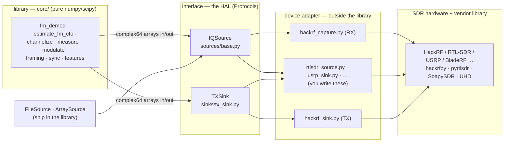

# Modularity: using sdr_dsp with any SDR

`sdr_dsp` is deliberately split so the signal processing never knows what radio
produced its samples. This document names the layers, shows where the seam is, and lists
what remains to be done to drive the library from a radio other than a HackRF.

## The layered model

```
   [ library ]  <->  [ interface ]  <->  [ device adapter ]  <->  [ SDR hardware ]
     core/            IQSource /           examples/ or your        radio + its
     pure DSP         TXSink (a HAL)       code (Adapter pattern)   vendor library
```

The vocabulary for the middle two boxes: the **interface** is a *hardware
abstraction layer* (HAL), expressed here as two Python `Protocol`s (structural,
"duck-typed" contracts). The **device adapter** (a.k.a. driver adapter) is the
*Adapter design pattern* — a small class that satisfies a protocol by wrapping a
vendor library. The core depends on the contract, never on a device; that
dependency inversion is the entire point.



## What each layer is, and where it lives

| Layer | What it is | Where it lives | Depends on |
|-------|-----------|----------------|-----------|
| library | Pure DSP: arrays in, arrays out. Knows nothing about radios. | `src/sdr_dsp/core/` | numpy, scipy only |
| interface (HAL) | Two `Protocol`s that define the RX and TX contracts. | `sources/base.py` (`IQSource`), `sinks/tx_sink.py` (`TXSink`) | numpy only |
| device adapter | A class that satisfies a protocol by wrapping a vendor library. | `examples/` or your own code — **outside** the library | the vendor library |
| SDR hardware | The radio and its driver stack. | n/a (hardware) | — |

The core's device-independence is a checked fact, not a wish: **nothing under
`src/` imports a vendor library.** Every `hackrfpy` mention in `src/` is a
docstring or a comment. Keep it that way (see *Keeping the core device-free*).

## The two contracts

An adapter only has to provide these attributes and methods. Anything that does
is an `IQSource` / `TXSink` as far as the library is concerned — no base class to
inherit, no registration.

**Receive — `IQSource`** (`sources/base.py`):

```python
sample_rate: float      # samples per second (Hz)
center_freq: float      # RF center frequency the samples were captured at (Hz)
def blocks(self) -> Iterator[np.ndarray]:   # yield complex64 blocks
    ...
# A bounded source may also offer read(n); live sources need only blocks().
```

**Transmit — `TXSink`** (`sinks/tx_sink.py`):

```python
sample_rate: float
center_freq: float
def transmit(self, iq: np.ndarray) -> None: # send one complex64 buffer
    ...
```

## What ships vs. what you write

Ships in the library (device-free, so the whole pipeline is testable with no
radio):

- `ArraySource` — wrap an in-memory `complex64` array (tests, synthetic signals).
- `FileSource` — stream a SigMF recording from disk; satisfies `IQSource`, so
  code written against a file runs unchanged against hardware later.
- `LoopbackSink` — a `TXSink` that "transmits" into an in-memory buffer, so the
  full TX stack (framing → modulate → sink) can be exercised without a radio.

You write (per radio, once):

- An `IQSource` adapter for receive, and/or a `TXSink` adapter for transmit.
- The reference adapters to copy are `examples/hackrf_capture.py` (RX) and
  `examples/hackrf_sink.py` (TX). The TXSink docstring names `usrp_sink.py` as
  the intended shape for the next one.

---

## What needs to be done to support another SDR

Porting the **DSP** to a new radio is small and clean. Porting the **collection
tooling** is the part with real work in it. The two are separated on purpose.

### 1. Sample-format normalization (belongs in the adapter)

The core only ever sees `complex64`. Real radios do not hand you `complex64` —
each vendor streams its own on-the-wire format, and converting it is the
adapter's job, not the core's. This is the single most common thing a new
adapter must get right.

| Radio (vendor lib) | Native sample format | Normalize to `complex64` by |
|--------------------|----------------------|------------------------------|
| HackRF (hackrfpy) | `ci8` (interleaved int8 I/Q) | `(i + 1j*q) / 128.0` |
| RTL-SDR (pyrtlsdr) | `cu8` (interleaved uint8, offset 127.5) | `((i - 127.5) + 1j*(q - 127.5)) / 127.5` |
| USRP (UHD) | `cf32` / `sc16` | cast to `complex64` (already float) / scale int16 by 32768 |
| SoapySDR devices | `CF32` or `CS16` (device-dependent) | as above, per the stream format you request |

The library already does exactly this for HackRF `ci8` in `io/sigmf.py`
(`load_iq`) and reuses it in `FileSource` — that is the template. An adapter's
`blocks()` should apply the equivalent normalization for its device and yield
`complex64`. **Do the scaling once, in the adapter; never push a device format
into the core.**

A good adapter also, in `blocks()`:

- yields `np.ascontiguousarray(..., dtype=np.complex64)` (some vendor buffers are
  views or non-contiguous);
- fills `sample_rate` and `center_freq` from what it actually tuned/requested,
  not from a constant, so downstream measurements (e.g. `estimate_fm_cfo`) are
  correct;
- handles partial/short reads at the stream tail without raising.

### 2. The collection tooling is HackRF-shaped (a real gap, not a bug)

The DSP is device-agnostic; the *gain-search and capture-quality* tooling is
not, and this is worth stating plainly so nobody assumes a free port:

- `sources/probe.py` expects a handle `h` with hackrfpy's `capture(...)`
  signature and routes captures through a file to dodge the Windows pipe
  corruption (see the module docstring).
- `core/gain_search.py` (`search_gain`) assumes the HackRF's three-knob gain
  model: `lna` / `vga` / `amp`, with the specific "SNR improves with amp+LNA,
  not VGA" strategy. That is right for the HackRF and wrong in the specifics for
  most other radios.
- `tools/preflight_collection.py` builds on both.

Porting a *receiver + demod* path to another SDR needs none of this — write an
`IQSource` and you are done. Porting *auto-gain search* needs a per-device gain
model. The clean way to do it, when the need arises, is to lift the gain
abstraction into its own small protocol (e.g. a `GainModel` with the device's
knobs and a `set(...)` method) so `search_gain` can drive any radio, rather than
special-casing hackrfpy. Until then, treat auto-gain as HackRF-only.

### 3. Keeping the core device-free (the invariant)

The whole design rests on `src/` importing no vendor library. That is easy to
break accidentally (one convenient `import` in a core module). Consider a guard
test that walks `src/sdr_dsp/` and asserts no module imports `hackrfpy` (or any
known vendor lib) — it is a one-file test that permanently protects the seam.
Adapters live in `examples/`, which is exempt.

### 4. A minimal adapter template

Receive (satisfies `IQSource`):

```python
import numpy as np

class RtlSdrSource:                 # structural IQSource; no base class needed
    def __init__(self, dev, sample_rate, center_freq, block_size=65536):
        self._dev = dev             # an opened pyrtlsdr device
        self.sample_rate = float(sample_rate)
        self.center_freq = float(center_freq)
        self.block_size = int(block_size)

    def blocks(self):
        for raw in self._dev.read_bytes_stream(self.block_size):   # cu8
            i = raw[0::2].astype(np.float32); q = raw[1::2].astype(np.float32)
            yield ((i - 127.5) + 1j * (q - 127.5)) / 127.5    # -> complex64
```

Transmit (satisfies `TXSink`):

```python
class RtlSdrHasNoTx: ...            # RTL-SDR is RX-only; TX example uses HackRF

class MyTxSink:
    def __init__(self, dev, sample_rate, center_freq):
        self._dev = dev
        self.sample_rate = float(sample_rate)
        self.center_freq = float(center_freq)

    def transmit(self, iq: np.ndarray) -> None:
        self._dev.write(to_device_format(np.ascontiguousarray(iq, np.complex64)))
```

Everything downstream — `fm_demod`, `estimate_fm_cfo`, `channelize`, the demod
family, framing, `measure` — runs against these unchanged.

### Porting checklist

- [ ] Write an `IQSource` adapter; normalize the device format to `complex64` in
      `blocks()` (§1).
- [ ] Set `sample_rate` / `center_freq` from what was actually tuned.
- [ ] (If transmitting) write a `TXSink` adapter; prove the stack against
      `LoopbackSink` first, then swap in the device.
- [ ] Validate against a file first: run the pipeline through `FileSource` on a
      saved capture, then against the live adapter — output should match.
- [ ] Leave `core/` untouched. If you found yourself editing it, the seam moved
      to the wrong place.
- [ ] Only if you need auto-gain: add a per-device gain model (§2). Otherwise set
      gains manually in the adapter.

---

*This is a personal research library; the abstractions above are real and
enforced today, but the collection-tooling generalization in §2 is future work,
not a shipped feature. See `sources/base.py`, `sinks/tx_sink.py`, and
`examples/hackrf_capture.py` for the authoritative reference.*
