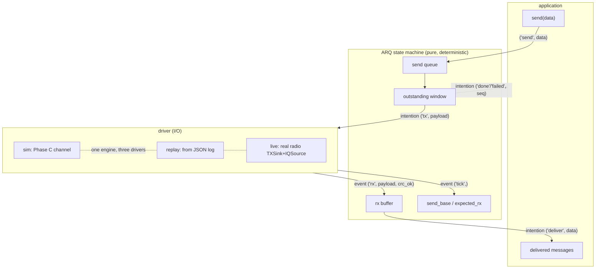

# sdr_dsp — Comprehensive Technical Documentation

A complete reference for the `sdr_dsp` library: what it is, how it's built, how
to use it, how to extend it, and where its weaknesses are and what
still needs real hardware to validate. This is the deep document; the README is
the quick start, and the call-level companion is
[`sdr_dsp_API_HANDBOOK.md`](sdr_dsp_API_HANDBOOK.md) — auto-generated from the
source, it holds every signature, parameter, default, and docstring. When this
document and the handbook disagree on a signature, the handbook (regenerated)
wins; when they disagree on intent or architecture, this document wins.

This document has been AI created based on existing documentation and a sweep of
all functions. It's being human validated as development continues. 

> **Status at time of writing:** RX path complete; TX path complete in software
> through Phase E's seam (real radiation pending bench). 355 tests passing, 1
> skipped (hardware). Windowed (N>1) ARQ and cumulative ACK are now validated
> correct under the loss-stress suites (§11.1); the honest remaining gaps are
> the model-vs-reality limits in §11.2–11.7 and the bench work in §12.

---

## Table of contents

1. What this is (and isn't)
2. Design philosophy
3. Architecture & layering
4. The full module map
5. Requirements & installation
6. Core concepts (IQ, the source→core→sink model)
7. Usage — receive
8. Usage — transmit & the link protocol
9. Extending the library: adding modulation/demodulation schemes
10. Development workflow & testing discipline
11. Known weaknesses & honest limitations
12. What needs real hardware to validate
13. Device fingerprinting: feature extraction & the impairment model
14. Sample data: what exists, what's needed
15. Experiments to characterize real RX/TX behavior
16. System flow diagrams (Mermaid + ASCII)

---

## 1. What this is (and isn't)

`sdr_dsp` is a **device-agnostic digital signal processing library for
software-defined radio**. It operates on complex baseband IQ samples
(`numpy.complex64`) and provides the building blocks to receive, analyze,
demodulate, modulate, frame, and reliably exchange data over a radio link.

**It is a library, not a framework.** It has no GUI, no flowgraph runtime, no
scheduler. You call functions and compose them. It complements GNU Radio (which
is a framework); it does not compete with it.

**It is device-agnostic.** The library knows about *no* specific radio. It reads
and writes IQ; device adapters (HackRF, USRP, RTL-SDR, files) live outside the
library and implement small protocols (`IQSource` for receive, `TXSink` for
transmit). This is the single most important architectural decision: the DSP
core never imports a device.

**What it deliberately is NOT:**
- a GUI / waterfall application (the live plot examples are examples, not the
  library);
- a flowgraph engine or scheduler;
- a full-duplex / real-time radio stack;
- a forward-error-correction (FEC) library;
- a wideband/distributed capture system.

These omissions are intentional and keep the library a library. They are "the
GNU Radio line" — past it, you'd be building a framework.

---

## 2. Design philosophy

Five principles govern every decision in the codebase:

**(a) The library implements its own radio operations.** It borrows `numpy.fft`
for the FFT and `scipy.signal` for filter *coefficient design* only ("scipy
designs the taps; we apply them"). Everything else — mixing, resampling,
demodulation, recovery, framing — is implemented in the library. `scipy` is also
used as a *test oracle* (design-time only), never as a runtime dependency for the
actual signal operations.

**(b) Honest, user-controlled DSP.** Normalization, carrier-frequency-offset
correction, AGC, calibration, recovery loops — all of these are **explicit and
opt-in**. The library *measures* but never silently *applies* corrections. A
function that adjusts a signal returns enough information to reverse the
adjustment (e.g. AGC returns the gain trace). No hidden assumptions.

**(c) Verify against truth.** Every nontrivial algorithm is tested against a
ground truth: `scipy` for filters/resampling, a known CRC check vector, the
round-trip `demod(modulate(x)) == x`, the naive loop for the polyphase
channelizer. Correctness is *demonstrated*, not asserted.

**(d) One-way dependency.** `core/` depends only on itself plus numpy/scipy. The
orchestration layers (`sources`, `sinks`, `io`, `stream`, `link`) sit *above*
core and may depend on it; core never depends on them. This is enforced by
convention and verifiable by grep.

**(e) The closed loop is the test.** Because the library both transmits and
receives, the strongest test is to feed a modulator's output into its
demodulator (optionally through a simulated channel) and confirm the message
survives. No external reference needed.

---

## 3. Architecture & layering

```
        ┌──────────────────────────────────────────────────────┐
        │                    application code                  │
        │              (examples/, user scripts)               │
        └──────────────────────────────────────────────────────┘
                │              │              │            │
                ▼              ▼              ▼            ▼
        ┌───────────┐  ┌───────────┐  ┌───────────┐  ┌──────────┐
        │  sources  │  │   sinks   │  │  stream   │  │   link   │  orchestration
        │ IQSource  │  │  TXSink   │  │ Pipeline  │  │   ARQ    │  (above core)
        │ ArraySrc  │  │ Loopback  │  │           │  │ drivers  │
        │ FileSrc   │  │  wav/iq   │  │           │  │ protocol │
        └───────────┘  └───────────┘  └───────────┘  └──────────┘
                │              │              │            │
                └──────────────┴──────┬───────┴────────────┘
                                      ▼
                       ┌───────────────────────────┐
                       │           core/           │   PURE DSP
                       │  demod/  modulate/        │   (numpy + scipy only)
                       │  filters resample mixing  │   never imports a layer
                       │  spectral measure detect  │   above it or a device
                       │  sync agc calibrate       │
                       │  channelize channel       │
                       │  framing util             │
                       └───────────────────────────┘
                                      │
                                      ▼
                              ┌──────────────┐
                              │  numpy/scipy │
                              └──────────────┘
```

The dependency arrow points strictly downward. `link/` is the newest peer of the
orchestration layers — it was deliberately moved out of `core/` because it is
application-protocol logic (ARQ over messages), not signal processing. It imports
nothing from `core`.

---

## 4. The full module map

### core/ — pure DSP (numpy + scipy only)
- **util.py** — `to_db`, `from_db`, `normalize`, `DB_EPSILON`.
- **filters.py** — `design_lowpass/bandpass/highpass` (scipy designs taps),
  `fir_apply`, `fir_apply_centered` (the library applies them).
- **resample.py** — `decimate`, `interpolate`, `resample_poly` (own polyphase,
  verified vs scipy).
- **mixing.py** — `frequency_shift`, `tune_to_baseband`, `remove_dc`.
- **spectral.py** — `psd`, `spectrogram`.
- **measure.py** — `power_dbfs`, `snr_db`, `occupied_bandwidth`, `find_bursts`,
  `estimate_cfo`.
- **detect.py** — `matched_filter`, `correlate`, `convolve`, `detect_peak`.
- **sync.py** — `carrier_recovery` (Costas/decision-directed), `symbol_sync`
  (Gardner/early-late/Mueller-Müller), `LoopDiagnostics`.
- **agc.py** — `agc`, `AGC` (opt-in, reversible: returns gain trace).
- **calibrate.py** — `power_dbm`, `Calibration`, `compute_cal_offset` (opt-in
  absolute power).
- **channelize.py** — `channelize` (single channel), `channelize_bank`
  (polyphase filterbank).
- **channel.py** — `apply_channel`, `add_noise`, `add_cfo`, `add_delay`
  (simulated propagation).
- **channel_impairments.py** — device-signature *synthesis* (the fingerprint
  forward model / test oracle): `add_iq_imbalance`, `add_pa_nonlinearity`,
  `add_phase_noise`, `DeviceImpairments`, `make_device_impairments`,
  `apply_device_impairments`. See §13.
- **framing.py** — `build_frame`, `find_frames`, `crc16`.
- **features/** — fingerprint feature *extraction* (see §13):
  - impairments.py (`iq_image_ratio`, `estimate_iq_imbalance`,
    `estimate_cfo_ppm`, `estimate_phase_noise_variance`),
    evm.py (`decide_symbols`, `error_vector`, `evm_stats`, `EVM_FEATURE_NAMES`),
    fingerprint.py (`fingerprint_vector`, `FEATURE_NAMES`).
- **demod/** — the demodulator package (see §9 for structure):
  - analog.py (fm/am/ssb/dsb_sc/cw/deemphasis), ask.py (ook/nask),
    fsk.py, psk.py (bpsk/qpsk/psk8/dbpsk/dqpsk), qam.py (qam16),
    spread.py (dsss/fhss), timing.py (edges/symbol-rate/slicing).
- **modulate/** — the modulator package (mirror of demod/):
  - analog.py (fm/am/ssb), digital.py (ook/fsk/bpsk/qpsk), shaping.py
    (rrc_taps/upsample/pulse_shape).

### sources/ — receive-side device seam
- **base.py** — `IQSource` protocol, `ArraySource`.
- **file_source.py** — `FileSource` (true incremental streaming from disk).

### sinks/ — output & transmit-side device seam
- **wav_sink.py** — `write_wav`.
- **iq_sink.py** — `write_iq`.
- **plot_sink.py** — `plot_spectrum`, `plot_spectrogram` (lazy matplotlib).
- **tx_sink.py** — `TXSink` protocol, `LoopbackSink`.

### io/ — file formats
- **sigmf.py** — `load_iq`, `save_iq`, `iq_info`, `Annotation`,
  `read_annotations`, `bursts_to_annotations` (SigMF, 6 IQ datatypes).

### stream/ — block orchestration
- **pipeline.py** — `Pipeline`, `Stage`, `PipelineStats`.

### link/ — ARQ link protocol (application layer)
- **protocol.py** — `pack_payload`, `unpack_payload`, type constants,
  `SEQ_MOD_MAX`.
- **arq.py** — `ARQ` (the event-driven state machine).
- **drivers.py** — `EventLog`, `run_sim`, `run_link`, `replay`, `LiveLink`,
  `perfect_transport`, `make_channel_transport`.

---

## 5. Requirements & installation

**Runtime dependencies:** `numpy>=1.26`, `scipy>=1.11`. That is the entire
hard dependency set. The library is pure Python + these two.

**Python:** `>=3.11`.

**Optional extras** (in `pyproject.toml`):
- `plotting` → matplotlib (for the plot sinks and example visualizations)
- `audio` → sounddevice (for live audio examples)
- `examples-hackrf` → hackrfpy (for the HackRF device adapters)
- `examples` → all of the above

**Build system:** hatchling. The package builds with `uv build` into a wheel +
sdist. Only `src/sdr_dsp/` ships — tests and examples are excluded.

**Install (development):**
```
uv sync                      # core deps
uv sync --extra examples     # everything for running examples
uv run pytest                # run the test suite
```

---

## 6. Core concepts

**IQ samples.** Everything is complex baseband: `numpy.complex64` arrays where
each sample's real and imaginary parts are the in-phase and quadrature
components. Sample rate (Hz) and center frequency (Hz) are the metadata needed
to interpret them.

**The source → core → sink model.** Data flows from a *source* (a file, an
array, a radio) through pure *core* DSP functions to a *sink* (a file, a plot, a
radio). The source and sink are *protocols* — anything implementing them works.
The core never knows or cares what the source/sink actually is.

**IQSource protocol (receive):**
```python
class IQSource(Protocol):
    sample_rate: float
    center_freq: float
    def blocks(self) -> Iterator[np.ndarray]: ...
```

**TXSink protocol (transmit, the mirror):**
```python
class TXSink(Protocol):
    sample_rate: float
    center_freq: float
    def transmit(self, iq: np.ndarray) -> None: ...
```

A `HackRFCapture` (RX) or `HackRFSink` (TX) implements these from *outside* the
library. So does an `ArraySource` or `LoopbackSink` for testing. The library
works against the protocol, never the device.

---

## 7. Usage — receive

A minimal receive chain: load IQ, tune to a channel, filter, demodulate.

```python
import sdr_dsp
from sdr_dsp.io import load_iq
from sdr_dsp.core import tune_to_baseband, design_lowpass, fir_apply, fm_demod

iq, meta = load_iq("capture.sigmf-meta")
fs = meta["global"]["core:sample_rate"]

# tune a channel at +200 kHz to baseband, filter, demod FM
base = tune_to_baseband(iq, 200e3, fs)
taps = design_lowpass(100e3, fs, num_taps=201)
audio = fm_demod(fir_apply(base, taps), deviation_hz=75e3, sample_rate=fs)
```

**Streaming from a file** (constant memory, block by block):
```python
from sdr_dsp.sources import FileSource
src = FileSource("big_capture.sigmf-meta", block_size=65536)
for block in src.blocks():
    process(block)            # each block is complex64
```

**A Pipeline** threads a source through pure stages to a sink with taps for live
observation:
```python
from sdr_dsp import Pipeline
from sdr_dsp.core import tune_to_baseband, fm_demod
pipe = (Pipeline(src)
        .add(lambda b: tune_to_baseband(b, 200e3, fs))
        .add(lambda b: fm_demod(b, 75e3, fs))
        .tap(lambda b: meter.update(b)))
pipe.run()
```

**Demodulators available:** FM, AM, SSB, DSB-SC, CW, OOK, NASK, FSK (binary +
N-level), BPSK, QPSK, 8-PSK, DBPSK, DQPSK, QAM-16, DSSS, FHSS. Each is a pure
function from IQ (or symbols) to bits/audio/symbols.

**Recovery** (carrier and timing) is opt-in and exposes its convergence:
```python
from sdr_dsp.core import carrier_recovery, symbol_sync
recovered = carrier_recovery(iq, method="costas", order=2)
synced, diag = symbol_sync(recovered, samples_per_symbol=8, method="gardner",
                           diagnostics=True)
diag.to_csv("loop_convergence.csv")   # per-sample convergence trace
```

---

## 8. Usage — transmit & the link protocol

**Modulation** is the inverse of demodulation. Same conventions, so the round
trip is exact:
```python
from sdr_dsp.core import bpsk_modulate, build_frame

bits = build_frame(b"HELLO")          # [preamble][sync][len][payload][CRC]
iq = bpsk_modulate(bits, samples_per_symbol=8, pulse_shaping=True)
```

**The simulated channel** degrades a signal in meaningful units, for testing:
```python
from sdr_dsp.core import apply_channel
rx = apply_channel(iq, sample_rate=fs, snr_db=15, cfo_hz=2000, seed=0)
```

**The ARQ link protocol** provides reliable, acknowledged message exchange. The
simplest entry point:
```python
from sdr_dsp.link import run_link
received, log = run_link([b"msg1", b"msg2"], window_size=1)   # stop-and-wait
log.save("exchange.json")             # record for later replay
```

**Record / replay** — the motivating feature. Run a real exchange once, save the
event log, then replay it with **zero transmission**:
```python
from sdr_dsp.link import EventLog, ARQ, replay
log = EventLog.load("exchange.json")
B = ARQ(window_size=1)
produced = replay(log, B, station="B")   # reproduces the exchange, no radio
```

**Over the real DSP chain** — wire the protocol to modulation + channel + demod:
```python
from sdr_dsp.link import make_channel_transport, run_link
transport = make_channel_transport(modulate_fn, demodulate_fn, channel_fn)
received, log = run_link(messages, transport=transport)
```

**Live (real radio)** — the `LiveLink` driver wires the ARQ engine to a `TXSink`
and a receive path. See §12 for the hardware-gated reality.

> **ARQ modes:** `window_size=1` is stop-and-wait (bulletproof, the supported
> default). `window_size=N` is sliding window (Selective Repeat) — see §11 for
> its current status and limitations.

---

## 9. Extending the library: adding modulation/demodulation schemes

This is a first-class workflow. The demod and modulate packages are deliberately
structured so a new scheme is a small, self-contained addition. Here is the full
recipe.

### 9.1 Where things live
- Demodulators: `src/sdr_dsp/core/demod/<family>.py` where family is one of
  `analog`, `ask`, `fsk`, `psk`, `qam`, `spread`, `timing`.
- Modulators: `src/sdr_dsp/core/modulate/<family>.py` where family is
  `analog`, `digital`, or `shaping`.
- If your scheme is a new family, add a new module and import it in the package
  `__init__.py`.

### 9.2 The contract a demodulator must satisfy
A demodulator is a **pure function**. It takes IQ (or symbols) plus the minimum
metadata to interpret them, and returns bits, symbols, or audio. It must:
- not mutate its input;
- not apply hidden corrections (no silent normalization/AGC/CFO removal — if the
  scheme needs them, expose them as parameters or document that the caller must
  do them first);
- return `numpy` arrays of a documented dtype;
- be deterministic.

### 9.3 The contract a modulator must satisfy
A modulator is the **inverse** of its demodulator. It takes bits/symbols plus
metadata and returns complex64 IQ. The defining requirement: `demod(modulate(x))`
must recover `x` exactly (digital: bit-exact; analog: high correlation). The bit
and symbol conventions MUST match the demodulator (this is the #1 source of bugs
— see the BPSK convention story in the development notes).

### 9.4 Step-by-step: adding a new digital scheme (worked example: MSK)

1. **Write the modulator** in `core/modulate/digital.py`:
   ```python
   def msk_modulate(bits, samples_per_symbol, sample_rate):
       """MSK: continuous-phase FSK with deviation = rate/4. OUR code."""
       # ... implement; return complex64
   ```
2. **Write the demodulator** in `core/demod/fsk.py` (MSK is an FSK variant):
   ```python
   def msk_demod(iq, sample_rate, samples_per_symbol):
       """Inverse of msk_modulate. Returns recovered bits."""
       # ... implement
   ```
   Match conventions: decide bit→symbol mapping once and use it on both sides.
3. **Export both** — add to the family module's `__init__` imports and the
   package `__all__`, then to `core/__init__.py`'s imports and `__all__`.
4. **Write the round-trip test** in `tests/test_modulate.py`:
   ```python
   def test_msk_roundtrip(bits):
       iq = msk_modulate(bits, 20, 1e6)
       rec = msk_demod(iq, 1e6, 20)
       assert np.mean(rec[:len(bits)] != bits) == 0   # BER 0
   ```
5. **Test through the channel** — confirm it degrades gracefully:
   ```python
   rx = apply_channel(iq, sample_rate=1e6, snr_db=20, seed=0)
   # demod rx, assert acceptable BER
   ```
6. **Test through framing** — confirm a packet survives:
   `build_frame → msk_modulate → (channel) → msk_demod → find_frames`.
7. **Add an example** in `examples/` if it's demonstration-worthy.

### 9.5 Step-by-step: adding a new analog scheme
Same pattern, but the round-trip test uses correlation rather than BER (analog
demod recovers a continuous message, so compare `corrcoef(original, recovered)`
> 0.99 after trimming edges). FM/AM/SSB are the templates to copy.

### 9.6 Pulse shaping
If your digital scheme is bandwidth-sensitive, use the shaping primitives
(`rrc_taps`, `upsample`, `pulse_shape`) on the TX side and a matched filter on
the RX side. The RRC root-root property gives zero ISI; the test is the same
round-trip but with matched filtering before slicing.

### 9.7 What NOT to do
- Don't reach into a device or a sink from a demod/mod — they are pure core.
- Don't add a runtime scipy dependency for the actual operation (scipy is design-
  time and test-oracle only).
- Don't apply corrections silently. If MSK needs the carrier recovered first,
  document that and let the caller call `carrier_recovery`.

---

## 10. Development workflow & testing discipline

**The test count is the signal.** Every feature lands with tests; the suite is
run after every change. Current: 355 passing, 1 skipped (hardware) — the most
recent addition being the hardware-readiness suite (`test_hardware_readiness.py`),
which closed the delay-sweep gap the closed-loop oracle had been missing.

**Test categories used throughout:**
- *Reference-oracle tests* — compare against scipy (filters, resampling) or a
  known check vector (CRC-16/CCITT-FALSE = 0x29B1).
- *Round-trip tests* — `demod(modulate(x)) == x`, the inverse relationship as the
  oracle. Bit-exact for digital, correlation for analog.
- *Naive-oracle tests* — the efficient algorithm vs the obvious slow one
  (polyphase channelizer vs the N-loop, 0.996 correlation).
- *Property/stress tests* — the protocol under burst and random loss across many
  configurations and seeds.
- *Hardware tests* — marked `@pytest.mark.hardware`, auto-skip without a device.

**Running tests:**
```
uv run pytest                              # full suite
uv run pytest tests/test_modulate.py -q    # one module
uv run pytest -m hardware                  # hardware-only (needs a device)
```

**After any API change**, regenerate the API handbook so it stays true to its
"cannot drift" promise (run from the `sdr_dsp/` project directory):
```
PYTHONPATH=src python3 ../docs/dev_handbook/generate_api_handbook.py > ../docs/sdr_dsp_API_HANDBOOK.md
```

**The discipline that has caught real bugs:** read what's actually in front of
you (the failing output, the file contents) rather than asserting from memory.
Several real bugs — the BPSK bit-convention inversion, the channelizer's mirrored
frequency axis, the windowed-ARQ window desync — were caught precisely because a
round-trip or stress test exercised the real path instead of a hoped-for one.

---

## 11. Known weaknesses & honest limitations

This section is deliberately candid. A library that hides its weak points is a
liability; one that names them is usable.

### 11.1 Windowed ARQ (N>1) — status
**Stop-and-wait (window_size=1) is bulletproof** and is the default. The
**sliding-window (N>1) Selective Repeat mode** is now validated as correct under
heavy stress: independent random loss up to 50%, ACK-preferential loss (40% ACKs
dropped), and a battery of burst-loss configurations — all delivering complete
and in order across window sizes 2–16.

**Cumulative ACK** (the opt-in `cumulative_ack=True`) is also now correct under
the same stress. It was previously buggy: the receiver could emit a cumulative
ACK naming an *out-of-order* sequence number, which told the sender a gap frame
had arrived when it hadn't, letting the sender reuse that sequence number while
the receiver still owed it (sequence aliasing — the wrong message delivered into
a slot). The fix: a cumulative ACK now *only* ever names the contiguous
high-water mark (`expected_rx - 1`), never an out-of-order frame's seq, and the
receiver emits no cumulative ACK at all until it has something contiguous to
acknowledge (the sender's timeout then drives retransmission of the gap frame).
Both ACK modes pass 100% of the random- and burst-loss stress suites.

**Remaining honest caveats:**
- The `seq_mod = 2*window_size` rule (textbook minimum for Selective Repeat) is
  load-bearing. It is sufficient because the sender bounds its window against its
  own base and the receiver only accepts in-window seqs — verified to keep the
  base/expected divergence within `window_size` even under 30% bidirectional
  loss. It is correct, but it is correct *because* of that bound, not by a
  separate proof; treat large custom `seq_mod` values with care.
- Cumulative ACK's traffic benefit (fewer ACKs) only materializes when multiple
  frames arrive before the receiver ACKs — i.e. batched/asynchronous arrival. The
  synchronous one-frame-per-tick simulation does not exhibit batching, so in
  *simulation* cumulative and selective send the same number of ACKs. The benefit
  is real only on hardware with bursty arrival (unvalidated — see §12).

### 11.2 The simulated channel is a model, not reality
`apply_channel` adds AWGN, a constant CFO, integer delay, scale, and phase. Real
channels have multipath, fading, phase noise, non-integer/​drifting delay,
frequency-dependent response, and non-Gaussian interference. The chain passing in
simulation does **not** prove it passes on hardware (see §12).

### 11.3 Simple demod paths are not sensitivity-optimized
The example chains use one-sample-per-symbol slicing without matched filtering in
several places. They work at moderate SNR and degrade earlier than a
matched-filter receiver would. This is honest (it's what the simple chain does)
but means the demonstrated SNR thresholds are conservative, not the best
achievable.

### 11.4 No forward error correction
There is no FEC. The CRC *detects* errors; it does not *correct* them. Reliability
comes from retransmission (ARQ), not coding. On a link where retransmission is
expensive, this is a limitation.

### 11.5 Sequence-number width caps the window
The protocol header packs `seq` in one byte, so `seq_mod <= 256` and hence
`window_size <= 128` with the default `seq_mod`. This is guarded (the constructor
raises rather than aliasing silently) but it is a hard ceiling.

### 11.6 Logical-tick timing is not wall-clock
The ARQ engine counts logical ticks, not seconds. This makes it deterministic and
replayable, but the mapping from ticks to real time — and whether timeouts are
appropriate for real half-duplex turnaround — is unvalidated and must be set on
the bench (§12).

### 11.7 Single-threaded, not real-time
The library is synchronous and single-threaded. It is not designed for
hard-real-time streaming; the Pipeline orchestrates blocks but does not guarantee
latency bounds.

---

## 12. What needs real hardware to validate

Everything below is proven in software but **unproven on a radio**. This is the
bench checklist.

**Transmit path:**
- [ ] The actual `transmit()` device call (currently a guarded, unimplemented
  stub in `HackRFSink`) — does the device radiate the IQ correctly?
- [ ] IQ format conversion (complex64 → the device's TX sample format) and
  scaling/gain staging.
- [ ] That a transmitted, framed packet is recoverable by a separate receiver
  with a good CRC (the wired one-way test).

**Timing (the biggest unknowns):**
- [ ] Half-duplex TX→RX turnaround time on each device.
- [ ] The tick→wall-clock mapping, and whether ARQ timeouts exceed a real
  round-trip + turnaround (otherwise spurious retransmits).
- [ ] Whether the preamble is long enough for a real receiver to lock timing
  before the sync word.

**Receive path:**
- [ ] Every demodulator against a real off-air capture, not just synthetic IQ.
  Each has a verified synthetic path; discrepancies isolate to signal/params.
- [ ] Carrier and symbol recovery convergence on real signals with real CFO,
  phase noise, and drift.
- [ ] AGC behavior on real signals with real dynamic range.
- [ ] Absolute power calibration against a known reference source.

**Protocol over the air:**
- [ ] A real two-station exchange (record the EventLog).
- [ ] Windowed mode (N>1) over a real lossy link — gated additionally on §11.1.

**Cross-vendor:**
- [ ] HackRF ↔ USRP interoperability (gain/level differences, the same TXSink
  protocol driving both).

---

## 13. Impairment modeling & feature extraction

Two radios sending identical bits emit different *waveforms*, because each carries
the additive physical signature of its analog hardware. `sdr_dsp` provides the
pure-DSP **feature extraction** and a matching **impairment synthesizer** to test
it against. Turning those feature vectors into device *identities* — the
classifier, labeled captures, trained models — is application logic that lives in
a separate consuming project (it needs sklearn/torch; the library must not). The
demonstrating example is `examples/impairment_extraction.py`.

This section is the architectural summary. The full mathematics — proofs,
physics, and history — lives with that consuming project
(`RF_FINGERPRINTING_MATH.md`), the natural home for the in-depth identification
story.

### 13.1 The dividing line

The same test as everywhere else in the library: *would this be useful to
someone not doing fingerprinting?* Extractors and the impairment model are
general DSP → they live in the library. The classifier, the labeled data, and
the trained models only make sense for identifying *your* devices → a separate
consuming project (`device-fingerprint/`, `uv add sdr_dsp`).

### 13.2 The forward model — `core/channel_impairments.py`

The test oracle: stamp a *known* signature onto a clean signal, then confirm the
estimators recover it. This is the fingerprinting analog of the scipy-oracle
filter tests. All obey the §2 contract (pure, deterministic given a seed,
complex64 in/out, numpy only).

- `add_iq_imbalance(iq, gain_db, phase_deg)` — mixer mismatch as
  `r = α·s + β·s*`; the `β·s*` conjugate-image term is the signature.
- `add_pa_nonlinearity(iq, coeffs)` — memoryless odd-order PA polynomial
  `Σ cₖ·x·|x|^{2k}` (AM/AM + AM/PM). **Note:** exactly zero effect on
  constant-envelope signals (see §13.5).
- `add_phase_noise(iq, linewidth_hz, sample_rate, seed)` — Wiener (random-walk)
  oscillator phase; per-step variance `2π·Δν/f_s`.
- `make_device_impairments(seed)` → `DeviceImpairments` — a frozen, inspectable
  bundle = one repeatable virtual device, drawn from realistic ranges.
- `apply_device_impairments(iq, device, fs, carrier, seed)` — apply the full
  signature in physical order (PA → imbalance → phase noise → CFO). Layer
  `apply_channel` on top for propagation effects.

This module sits *beside* `channel.py`, not inside it, on purpose: `channel.py`
models propagation (what happens *between* radios), this models the transmitter
(what a device stamps on *everything* it sends).

### 13.3 The estimators — `core/features/impairments.py`

Each inverts one impairment and returns numbers, never a correction (the honest-
DSP rule):

- `iq_image_ratio(iq)` → `|E[r²]|/E[|r|²]`. **The** feature to classify on:
  rotation-invariant, so it depends on the transmitter's image rejection, not on
  where your receiver sampled the carrier phase (a bulk phase rotation multiplies
  `E[r²]` by `e^{2jθ}`, which the magnitude discards — proof in the consuming
  project's math doc).
- `estimate_iq_imbalance(iq)` → `(gain_db, phase_deg)`. Split form, for
  diagnostics — rotates with the carrier, so treat with care in a classifier.
  Guarded: warns on improper input (§13.5).
- `estimate_cfo_ppm(cfo_hz, carrier_hz)` — thin Hz→ppm conversion (the
  device-comparable crystal unit); the absolute Hz comes from
  `measure.estimate_cfo`.
- `estimate_phase_noise_variance(iq, reference=None)` — residual phase-error
  variance; differences the phase to reject constant CFO. Device-linked only
  against a reference or post-demod (§13.5).

### 13.4 EVM / error cloud — `core/features/evm.py` and assembly

After deciding symbols, the error `e = r − ŝ` carries the signature the bits
discard. `evm_stats` returns nine moments (`EVM_FEATURE_NAMES`): magnitude
(evm_rms, mean) plus the *shape* moments (per-quadrature variance, skew,
kurtosis, I/Q correlation) that distinguish a noise-dominated Gaussian ball from
a device-dominated structured cloud. `decide_symbols` and `error_vector` are the
pure helpers beneath it.

`core/features/fingerprint.py` assembles everything into one stable, ordered
vector (`FEATURE_NAMES`, length 14 without symbols; the EVM slots fill with NaN
until synchronized symbols are supplied). Append new features at the END, never
insert — the classifier relies on the ordering.

### 13.5 The three traps (and how the code guards them)

Physics constrains what's estimable, and the library refuses to pretend
otherwise:

1. **Properness.** I/Q-imbalance estimation assumes `E[s²]=0` (QPSK/QAM/GFSK).
   On an improper signal (OOK, BPSK, DC, a tone) `E[s²]≠0` already, and the
   estimator reads *modulation* as *device* — a clean OOK signal reports image
   ratio ≈ 1.0. `estimate_iq_imbalance` emits a `RuntimeWarning` when `|c|>0.5`.
2. **Constant envelope.** PA nonlinearity is *exactly* invisible on a constant-
   envelope signal (`|x|=A` ⇒ `y = x·ΣcₖA^{2k}`, one complex constant). GFSK/FSK
   have no PA fingerprint; only amplitude-varying modulations (QAM, OFDM, OOK
   edges) expose it. Documented on `add_pa_nonlinearity`.
3. **SNR trap.** `evm_rms`/`evm_mean_mag` scale with receiver noise — at moderate
   SNR they're a distance-to-antenna thermometer, not a device feature. Weight
   the shape moments. Documented on `evm_stats`.

### 13.6 The separability guard — the go/no-go

`test_fingerprint_separates_devices_across_channels` is the fingerprinting analog
of the ARQ loss-stress suites: it asserts within-device feature variance (across
channels) is smaller than between-device variance (across devices). With only the
two symbol-free features it reaches ~68% five-way (chance 20%) — deliberately
modest, guarding the weak path so a regression toward chance is caught. Strong
separability comes from the symbol-domain EVM features plus more captures.

**The honest bottom line:** whether fingerprinting works for *your* devices
through *your* receiver is an empirical `S_B/S_W` measurement, not a theorem. The
cheap first experiment (before building any classifier): capture a few bursts
each from several *same-model* devices plus repeat captures of one device across
hours/temperature, compute `cfo_ppm`, and compare within- vs between-device
spread. If same-model crystals don't separate, or one drifts across another
overnight, the steady-state approach needs rethinking — an afternoon spent, not a
project. See §12 for the hardware-validation checklist this feeds into.

---

## 14. Sample data: what exists, what's needed

**Exists** (`sample_data/`):
- `fm_2Msps.iq` + `.sigmf-meta` — an FM capture at 2 Msps.
- `fm_sweep.csv` — a frequency sweep reference.

**Needed for fuller coverage** (collect on the bench / off-air):
- **Real captures per modulation** — at least one off-air or wired capture of
  each digital scheme (OOK, FSK, the PSK family) with known ground-truth bits, so
  demod tests can run against reality, not just synthesis.
- **A captured ARQ exchange** — a real two-station EventLog + the corresponding
  SigMF IQ, so the protocol can be replayed and the pcap converter exercised.
- **A calibration reference capture** — a signal of known absolute power, to
  validate `compute_cal_offset` / `power_dbm`.
- **A multipath / fading capture** — to expose where the AWGN-only channel model
  diverges from reality.
- **Low-SNR captures** — real signals near the demod threshold, to compare the
  measured vs simulated SNR cliff.
- **A frequency-drifting source** — to test CFO estimation and carrier recovery
  against real oscillator drift.

Each new sample should ship with a SigMF sidecar documenting capture conditions
(device, rate, center freq, gain, antenna, known signal content).

---

## 15. Experiments to characterize real RX/TX behavior

Concrete experiments to run with the HackRF One (and other RF gear) to get the
data the simulation can't provide. Ordered roughly easiest → hardest.

### 14.1 RX characterization (no transmit, lowest risk)
1. **Noise floor & SNR mapping.** Capture with no signal, measure the noise floor
   (`power_dbfs`). Then capture a known signal at varying generator output levels;
   plot measured SNR (`snr_db`) vs generator level. Establishes the real SNR
   scale vs the simulated one.
2. **CFO reality.** Capture a known-frequency CW tone; run `estimate_cfo`. Repeat
   over time to measure oscillator drift. Compares real CFO/drift to the constant-
   CFO channel model.
3. **Demod threshold per scheme.** Use a signal generator (or a second SDR) to
   produce each modulation at decreasing SNR; find the BER cliff. Compare to the
   simulated `channel_sweep` thresholds — quantifies §11.3.
4. **AGC on real dynamic range.** Capture a signal that fades or varies in
   amplitude; run the AGC; inspect the gain trace. Confirms the AGC settles on
   real envelopes, not just synthetic steps.

### 14.2 Wired TX/RX (transmit, but contained)
5. **Wired one-way packet.** TX → attenuator → RX coax. Transmit a framed packet
   (OOK/FSK first — most robust); confirm `find_frames` recovers it with good
   CRC. The first real proof the TX path works. Vary attenuation to find the
   wired SNR threshold.
6. **Turnaround measurement.** Transmit, then switch to receive and timestamp how
   long until the receiver is ready. This is the number that sets the ARQ
   timeout. Do it per device.
7. **Wired ARQ exchange.** Run a real two-station stop-and-wait exchange over the
   wired link; record the EventLog. Replay it (zero TX) to confirm the recording
   reproduces. Convert to pcap, open in Wireshark.

### 14.3 Over-the-air (only where legal/licensed)
8. **Short-range OTA packet.** Same as the wired packet test but radiating, on a
   permitted band at minimal power. Confirms the antenna path.
9. **Real lossy-link ARQ.** An exchange over a genuinely lossy OTA link;
   measure retransmit rate vs the simulated prediction. This is the experiment
   that would validate (or break) the windowed mode of §11.1.

### 14.4 What each experiment feeds back
- Experiments 1–3 calibrate the *channel model* against reality.
- Experiments 5–6 produce the *timing constants* the protocol needs.
- Experiments 7–9 produce the *captured exchanges* (§13) that become regression
  fixtures and the basis for the pcap tooling.

---

## 16. System flow diagrams

### 15.1 The ARQ engine — event/intention model (Mermaid)



### 15.2 Full TX→RX signal & protocol flow (Mermaid)

```mermaid
flowchart LR
    MSG[message bytes] --> PP["pack_payload (type,seq)"]
    PP --> BF["build_frame (preamble,sync,len,CRC)"]
    BF --> MOD["modulate (ook/fsk/psk...)"]
    MOD --> SHAPE["pulse_shape (optional RRC)"]
    SHAPE --> SINK["TXSink.transmit"]
    SINK --> CH{{"channel: real RF
or apply_channel sim"}}
    CH --> SRC["IQSource.blocks"]
    SRC --> RECOV["recovery (carrier/symbol, optional)"]
    RECOV --> DEMOD["demodulate"]
    DEMOD --> FF["find_frames (+ CRC check)"]
    FF --> UP["unpack_payload"]
    UP --> ARQ["ARQ engine: deliver / ack / retransmit"]
```



### 15.3 Layer dependency (ASCII, the load-bearing invariant)

```
   application / examples
            │  (may import anything below)
   ┌────────┼─────────┬──────────┬─────────┐
sources   sinks    stream      link      io       ← orchestration peers
   │        │         │          │        │          (import core; not each
   └────────┴────┬────┴──────────┴────────┘           other, not devices)
                 │
               core/                                  ← pure DSP
                 │                                       (imports ONLY numpy,
              numpy/scipy                                 scipy; never upward)
```

### 15.4 The record/replay property (ASCII)

```
  LIVE RUN (once, real radio):
     app sends ──► ARQ ──tx──► modulate ──► radio ──► ... 
                    ▲                                   │
                    └────── rx events ◄── demod ◄───────┘
                    │
                    └──► EventLog records every rx/tick/send  ──► exchange.json

  REPLAY (any time after, NO radio):
     exchange.json ──► feed rx/tick events ──► ARQ ──► identical deliveries
                                                        (zero transmission)
```

---

## Appendix: quick reference

- **Run tests:** `uv run pytest`
- **Build:** `uv build` (wheel + sdist in `dist/`)
- **Receive a channel:** `tune_to_baseband` → `design_lowpass`/`fir_apply` →
  `<scheme>_demod`
- **Transmit a packet:** `build_frame` → `<scheme>_modulate` → `TXSink.transmit`
- **Reliable messaging:** `run_link(messages, window_size=1)`
- **Record/replay:** `log.save(path)` / `EventLog.load(path)` + `replay()`
- **Add a scheme:** modulator + demodulator with matching conventions +
  round-trip test (§9)
- **Supported default for correctness-critical use:** stop-and-wait
  (`window_size=1`)
